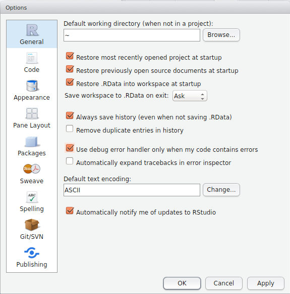
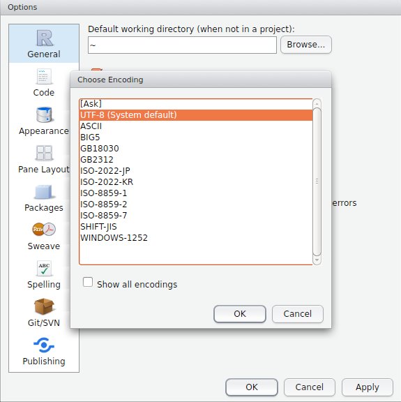

# Introducción a la Estadística
Curso en swirl sobre "Introducción a la estadística" en español que cubre conceptos estadísticos básicos tales como muestreo, tipos de variables, estadísticos descriptivos, y visualización de datos. Este curso ha sido adaptado por el [Dr. Alcides Chaux](https://github.com/alcideschaux) para su uso en español a partir del curso correspondiente alojado en el repositorio de cursos oficial de swirl en [https://github.com/swirldev/swirl_courses](https://github.com/swirldev/swirl_courses).

Este curso puede ser usado con la versión original (en inglés) de swirl, disponible a través de CRAN, o con la versión en español, según se muestra más abajo.

## Instalación del curso
Para instalar el curso debes tener primero swirl instalado en R. Si ya tienes instalado swirl en tu sistema puedes obviar los siguientes 3 pasos y pasar directo a la instalación del curso propiamente dicho. Para instalar la versión original en inglés desde CRAN abre R/RStudio y usa:

```
install.packages("swirl")
```

Puedes instalar la versión en español de swirl usando el comando:

```
devtools::install_github("alcideschaux/swirl-spa")
```

Ten en cuenta que para ejecutar el código anterior debes tener instalado el paquete `devtools` en tu sistema. Una vez que tengas instalado swirl carga la librería correspondiente con:

```
library(swirl)
```

Puedes instalar el curso alojado en este repositorio usando el comando:

```
install_course_github("alcideschaux", "Introduccion_a_la_Estadistica")
```

Alternativamente, se puede instalar este curso bajándolo como archivo comprimido haciendo click en [Introduccion_a_la_Estadistica.zip](https://github.com/alcideschaux/Introduccion_a_la_Estadistica/blob/master/Introduccion_a_la_Estadistica.zip). Una vez bajado el archivo, se debe ingresar el siguiente comando en R/RStudio:

```
install_course_zip("~Downloads/Introduccion_a_la_Estadistica.zip")
```

donde `~Downloads/Introduccion_a_la_Estadistica.zip` es la ruta del archivo bajado.

Una vez que finalice la instalación del curso puedes lanzar swirl y seleccionarlo desde el menú principal. Para lanzar swirl tipea `swirl()` en la linea de comandos.

## Lecciones contenidas en el curso
Este curso de "Introducción a la Estadística" contiene una única lección 'Generalidades'. Al final de la lección se encuentra una breve evaluación del Curso.

## Problemas conocidos
Aquellos usuarios de Microsoft Windows podrían observar símbolos inusuales reemplazando los caracteres acentuados. Esto es porque Windows utiliza por defecto un sistema de codificación ([Windows 1252](http://es.wikipedia.org/wiki/Windows-1252)) distinto al de Linux ([UTF-8](http://es.wikipedia.org/wiki/UTF-8)). Esto se puede resolver fácilmente desde RStudio, cambiando el sistema de codificación para que los caracteres acentuados se muestren correctamente.

Para cambiar el sistema de codificación lanza RStudio y abre la ventana de opciones desde `Tools -> Global Options`.



Desde ahí, en la ventana `General` ve a la sección `Default text encoding` y haz click en el botón `Change...` (ver figura arriba). Se abrirá una nueva ventana, en la cual deberás seleccionar `UTF-8` como opción (ver figura abajo, ten en cuentra que las figuras pueden verse ligeramente diferentes en tu computadora).



Una vez seleccionada `UTF-8` como opción apretar `OK` para ir a la ventana de opciones globales, y `OK` nuevamente ahí para volver a RStudio. Esto debería solucionar el problema de los caracteres acentuados.

Recuerda reiniciar RStudio antes de volver a cargar `swirl`, para que los cambios surtan efecto.

## Distribución del curso
Siguiendo la política establecida en el repositorio oficial de cursos de swirl, este curso puede utilizarse libre y gratuitamente.

## Reporte de errores
Si encuentras algún error en curso por favor notificalo a [alcideschaux@uninorte.edu.py](mailto:alcideschaux@uninorte.edu.py).